[![Contributors][contributors-shield]][contributors-url]
[![Forks][forks-shield]][forks-url]
[![Stargazers][stars-shield]][stars-url]
[![Issues][issues-shield]][issues-url]
[![MIT License][license-shield]][license-url]
[![LinkedIn][linkedin-shield]][linkedin-url]
<a name="readme-top"></a>

<br />
<div align="center">
<h3 align="center">UsersCRUD </h3>

  <p align="center">
    Simple CRUD application to manage users created to practice Model-View-Controller design.  
    <br />
    <a href="https://github.com/mateuszmarc/Workshop3"><strong>Explore the docs »</strong></a>
    <br />
    <br />
    <a href="https://github.com/mateuszmarc/Workshop3">View Demo</a>
    ·
    <a href="https://github.com/mateuszmarc/Workshop3/issues/new?labels=bug&template=bug-report---.md">Report Bug</a>
    ·
    <a href="https://github.com/mateuszmarc/Workshop3/issues/new?labels=enhancement&template=feature-request---.md">Request Feature</a>
  </p>
</div>


<!-- TABLE OF CONTENTS -->
<details>
  <summary>Table of Contents</summary>
  <ol>
    <li>
      <a href="#about-the-project">About The Project</a>
      <ul>
        <li><a href="#built-with">Built With</a></li>
      </ul>
    </li>
    <li>
      <a href="#getting-started">Getting Started</a>
      <ul>
        <li><a href="#prerequisites">Prerequisites</a></li>
        <li><a href="#installation">Installation</a></li>
      </ul>
    </li>
    <li><a href="#usage">Usage</a></li>
    <li><a href="#roadmap">Roadmap</a></li>
    <li><a href="#contributing">Contributing</a></li>
    <li><a href="#license">License</a></li>
    <li><a href="#contact">Contact</a></li>
    <li><a href="#acknowledgments">Thoughts and future extensions</a></li>
  </ol>
</details>


<!-- ABOUT THE PROJECT -->
## About The Project

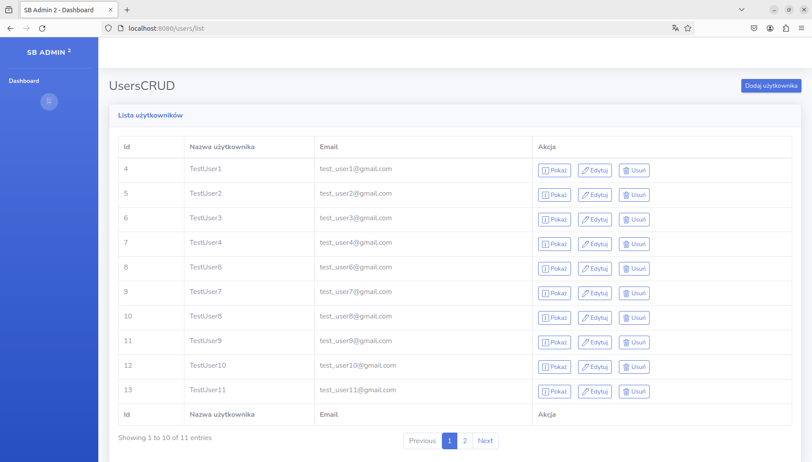

As I said before it is just simple users management app created to practise Model-View-Controller design.
App allows admin to:
* [List all users](#read-all)
* [Create users](#create)
* [Edit existing users ](#edit)
* [Display user's details](#read)
* [Delete users](#delete)

### Built With

* [![html5][html.com]][html5-url]
* [![javascript][javascript.com]][javascript-url]
* [![Bootstrap][Bootstrap.com]][Bootstrap-url]
* [![Java][Java.com]][Java-url]
* [![ApacheTomcat][ApacheTomcat.com]][ApacheTomcat-url]
* [![MySql][mysql.com]][mysql-url]


<p align="right">(<a href="#readme-top">back to top</a>)</p>

### Implementation
Project was built based on Model-View-Controller design pattern.
Model layer is implemented on Data Object Access design pattern that communicates with database.
Controller is implemented by Tomcat and its servlet container. 
Server is built using Tomcat, which also manages MySql database connection.
View is provided by jsp files supported by JSTL library and Expression Language.
View is based on bootstrap Admin - 2 theme: https://startbootstrap.com/theme/sb-admin-2.


<p align="right">(<a href="#readme-top">back to top</a>)</p>

<!-- GETTING STARTED -->
## Getting Started

### Prerequisites

You don't need much to use this app but below might help
*  Code editor, for example: [intelliJ](https://www.jetbrains.com/idea/)
* Installed [Apache Tomcat](https://tomcat.apache.org/)
* Installed [MySql](https://www.mysql.com/)
* Installed [Java JDK](https://www.java.com/pl/) 

### Installation

1. Clone the repo
   ```sh
   git clone https://github.com/mateuszmarc/Workshop3.git
   ```
2. Open the project in IntelliJ IDEA. 
3. Set up a local MySQL connection in IntelliJ IDEA.

4. Create MySql database witch using following command: 
```sql
CREATE DATABASE workshop3
CHARACTER SET utf8mb4
COLLATE utf8mb4_unicode_ci;
```
5. Run ```installation/workshop3.sql``` sql dump to create needed table or just execute below sql statement:
```sql
CREATE TABLE users (
    id int(11) NOT NULL PRIMARY KEY AUTO_INCREMENT,
    email varchar(255) NOT NULL UNIQUE,
    username varchar(255) NOT NULL,
    password varchar(60) NOT NULL
);
```
7. Set up a local MySQL connection in IntelliJ IDEA.
8. Build Tomcat server 

<p align="right">(<a href="#readme-top">back to top</a>)</p>


<!-- USAGE EXAMPLES -->
## Usage
In order to start using app just run your Tomcat server. It will open welcome page. 
### READ ALL
Display all users from the database.


#### How does it work?
There are 10 records displayed on the site - to change it set value for ```RECORD_NUMBER_BY_PAGE``` in ReadAll.java file.
Number of pages is calculated by dividing number of retrieved records by servlet constance ```RECORD_NUMBER_BY_PAGE```.
Based on number of the records in the database and ```RECORD_NUMBER_BY_PAGE``` there will be as many buttons to go to next records. 
In order to see next records just simply click in ```Next``` button. To se previous records click ```Previous``` button.
View gives also information which records are currently displayed ("Showing x to x of x entries").

### CREATE
Add new user to the database.

#### How does it work?
Every input has requirements to get positively validated:
Two validation layers are implemented: by front-end ```edit-and-add-user.js``` file and by back-end. 

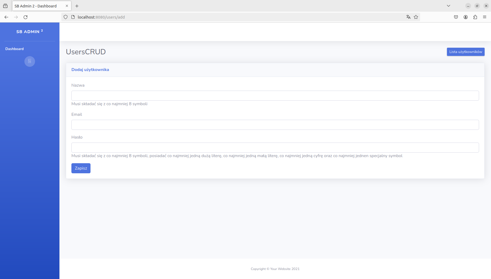

InputValidator validates input username, email and password:
* ```username``` requirements:
    * must contain alphanumeric characters
    * minimum 8 to 20 characters
    * first character has to be alphanumeric
    * can contain ',' or '_' but they cannot be typed as two in the row for example: "__" or "._" or "_." or ".." - username will be invalid with such combination.
    * lat character also has to be alphanumeric
* ```email``` Please see below regex for email:
    * "[_a-zA-z0-9-]+(\\.[_a-zA-Z0-9-]+)*@[a-zA-Z0-9-]+(\\.[_a-zA-Z0-9-]+)*\\.([a-zA-Z]{2,}){1}"
* ```password``` requirements:
    * Minimum eight characters
    * at lead one upper case character
    * at least one lowercase character
    * at least one number
    * at least one special character

First validation is performed by front end ```edit-and-add-user.js``` input tag attribute, so we avoid sending request with blank data.
After all fields are populated with some input and validated by front-end, passed parameters are sent to servlet.
Then given parameters are used in instantiation ```User``` object which will be used as parameter for
```create``` method from ```UserDao``` class.
Then helper class ```InputValidator``` static method ```validateUser``` gets invoked that validates every data field from ```User``` instance.
Then two scenarios are possible:
If validation returns boolean _false_ then method terminates returning null value - which means that update query
is not even executed.
Then ```doPost``` method checks the ```User``` instance returned from ```create``` method and sets ```input``` parameter
accordingly. If ```user``` reference holds null it means that record was not created in database.
If user is added in database then ```input``` is set to "valid", "invalid" otherwise.
Then we get redirected again to ```doGet``` method that checks `input` parameter. It sets `isUserAdded` attribute accordingly.
Based on its value, different views are displayed (flow-control is implemented in View layer):
* If `isUserAdded` is null add above user form will get displayed.
* If `isUserAdded` is set to "false" it means either that data provided is invalid or provided e-mail is already assigned to other user:

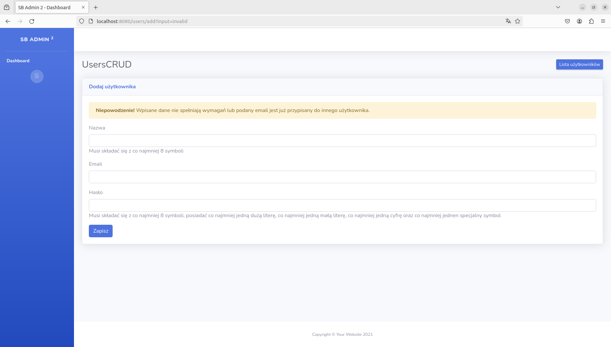

If validation returns boolean value _true_ then ```Connection``` to database is created along with ```PreparedStatement```.
Before new record added then password is hashed using ```Bcrypt``` class and its method ```hashpw```.
If provided email is not assigned to the other record in database then generated id is set to `id` field of ```User``` instance  that will
be returned from method. If there is already email assigned then ``SQLException`` is caught and method terminates returning `null`.
Then again ```doPost``` method checks if returned value is valid instance of ```User``` class. If it does then `input` is set to be
"valid".
Based on that parameter, doGet method sets `isUserAdded` to boolean _true_ that will determine what will be displayed
in ```add-user-form.jsp``` file:


### EDIT
Modify user details in the database.

#### How does it work?
As we all know we can access particular views (if they exist) typing url path. Then I had to make my application more
robust:

If user enters url manually without any `id` parameter specified, then doGet method will redirect to
```PageNotFound``` servlet:

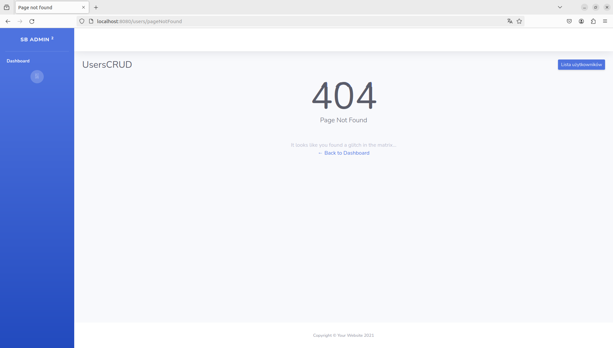

If admin user enters url with id parameter value that is not in database then ```read``` method from ```UserDao``` class will
return ```null``` which is going to be passed as `user` attribute for ```edit-user-form.jsp```.
Then such view will be displayed:

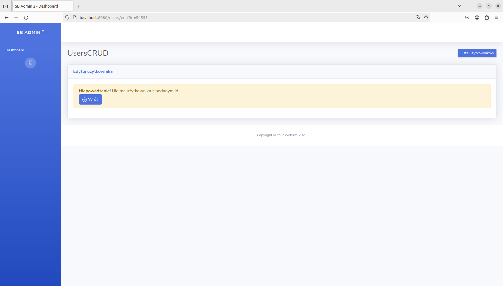

To edit user we click **edit** button that is displayed along with **show** and **delete** buttons in ```list.jsp``` file.
Every **edit** button is an anchor tag that sets url `id` parameter taken from displayed record.
This `id` parameter is taken by ```doGet``` method of ```Edit``` servlet.
Then given `id` is used in ```read`` method from ```UserDao``` class that creates `User` instance based on retrieved data.
User instance is passed to the view as attribute of which data fields will populate(except password - it needs to be reentered) `edit-user-form.jsp` fields:

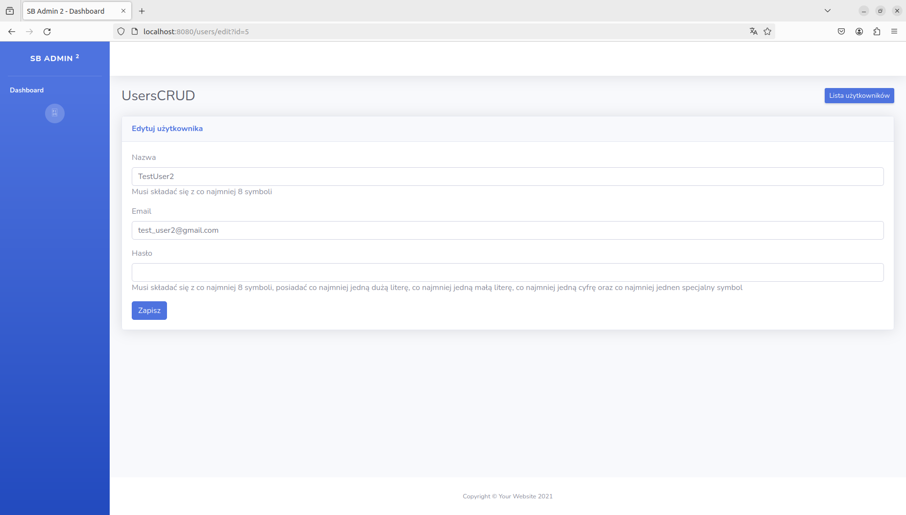

After all input fields got some data entered and edit button clicked then again front-end validates entered data. If it is valid, all data is passed to `doPost` method.
Then passed `username`, `email`, `password` parameters are used to instantiate new `User` object that will be passed as
parameter to `update` method from ```UserDao``` class. This method also uses ```InputValidator``` to check if passed data fields from
User object meet requirements. If they don't then `update` method returns false which results with setting attribute
`isUserUpdated` to _false_ and passing attribute `user` as user with old data(to repopulate the edit input fields so user can try again entering correct values this time).
It will result with such view displayed:

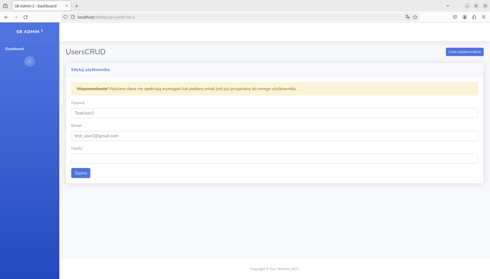

If `InputValidator` returns _true_ then Connection to database is created along with PreparedStatement object.
If provided email is used in other record then again above screen will be displayed (`isUserUpdated` will be set again to _false_).
However, if database record gets updated, then `isUserUpdated` will be set to true and `user` attribute will be set to
updated instance of User class (with newly entered data).
These attributes are again passed to ```edit-user.jsp``` file which will result in such view displayed:

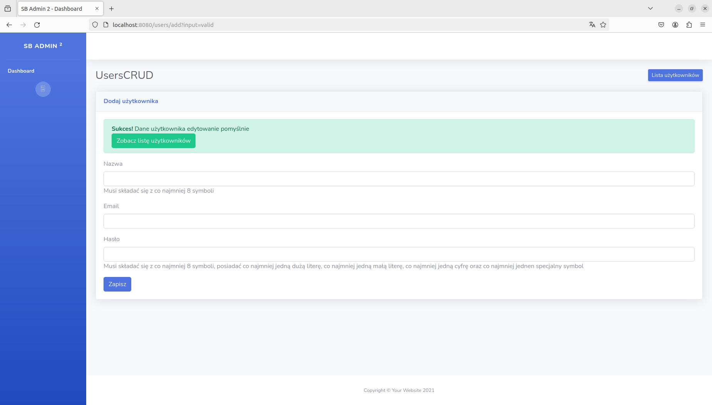

### DELETE
Remove user from the database.

#### How does it work?
Again as we all know we can access particular views (if they exist) typing url path. Then I had to make my application more
robust:

If admin user enters invalid `id` parameter in url then admin gets redirected to `404.jsp` view:


If admin enters `id` parameter in url that is not in database then there is no user to delete.
It means that delete `method` from `UserDao` class will return _false_.
It will set attribute `isDeleted` to _false_. It is passed to `delete.jsp` file. It will result with such
view:

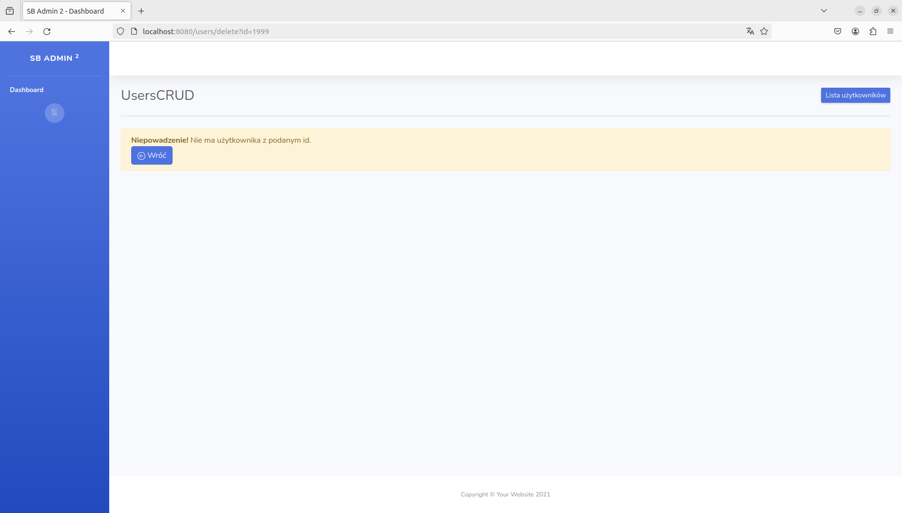

If admin clicks **delete** button associated with particular record in `list.jsp` then valid id is passed to
`delete` method of `UserDao` class.
It means that `delete` method from `UserDao` class will return _true_.
If deletion is performed successfully then `isDeleted` attribute is set to _true_ that is passed to `delete.jsp` view.
It results with such view:

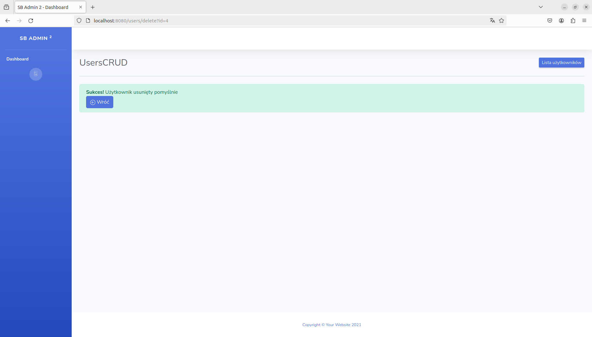

### READ
Retrieve user information from the database.

#### How does it work?

Again, application user might try to enter url path to access particular view.

If admin user enters url without `id` parameter specified then again will be redirected to pageNotFound address.

If admin enters url with `id` parameter that is not associated with any record in database then `read` method
from `UserDao` class will return _null_. This object is then set to `user` attribute and passed to `show.jsp` file.
Then based on value form `user` attribute following information will be displayed:

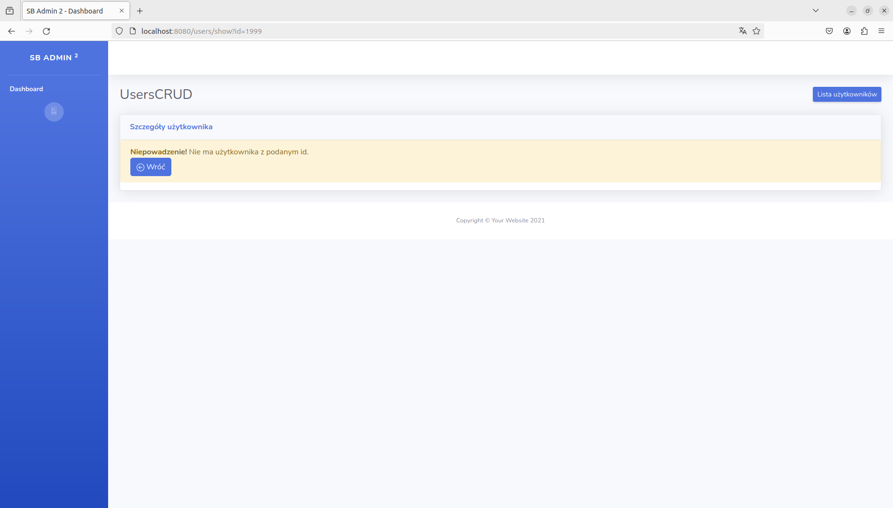

However, if user enters in url id, that exists in database then the user details will be displayed successfully.

To get user details displayed, we click **show** button that is displayed along with **delete** and **edit** buttons in list.jsp file.
Every show button is an anchor tag that sets `id` parameter taken from displayed record that redirects us to `ShowUser` servlet.
This it is passed as argument for `userId` parameter from read method from `UserDao` class.
If record with given id exists in database, then new instance of User class is created with its data fields
populated with and
returned to `doGet` method from `ShowUser` servlet. Then this instance is set as an `user` attribute and
passed to `show.jsp` file.
Data fields from `User` instance will populate table rows to display all data except password:

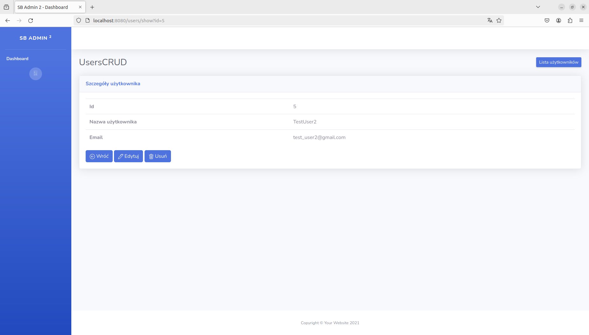
Again from this view we are able to edit or delete particular user.

<p align="right">(<a href="#readme-top">back to top</a>)</p>


<!-- ROADMAP -->
## Roadmap

- [x] Displaying all users
- [x] Create new user
- [x] Update user
- [x] Delete user
- [x] Display user details


See the [open issues](https://github.com/mateuszmarc/Workshop3/issues) for a full list of proposed features (and known issues).

<p align="right">(<a href="#readme-top">back to top</a>)</p>


<!-- CONTRIBUTING -->
## Contributing

Contributions are what make the open source community such an amazing place to learn, inspire, and create. Any contributions you make are **greatly appreciated**.

If you have a suggestion that would make this better, please fork the repo and create a pull request. You can also simply open an issue with the tag "enhancement".
Don't forget to give the project a star! Thanks again!

1. Fork the Project
2. Create your Feature Branch (`git checkout -b feature/AmazingFeature`)
3. Commit your Changes (`git commit -m 'Add some AmazingFeature'`)
4. Push to the Branch (`git push origin feature/AmazingFeature`)
5. Open a Pull Request

<p align="right">(<a href="#readme-top">back to top</a>)</p>


<!-- LICENSE -->
## License

Distributed under the MIT License. See `LICENSE` for more information.

<p align="right">(<a href="#readme-top">back to top</a>)</p>


<!-- CONTACT -->
## Contact

Mateusz Marcykiewicz - mmarcykiewicz@gmail.com

Project Link: [https://github.com/mateuszmarc/Workshop3](https://github.com/mateuszmarc/Workshop3)

<p align="right">(<a href="#readme-top">back to top</a>)</p>


## Thoughts and future extensions
Project helped me get little better familiar with using servlets, database connection, SQL as well as with passing data from controller to view via attributes and parameters. 
In the future, project would be easily extended with adding additional database storing admin records that could manage list of users. 
Every admin would have to go through login process in order to get access to CRUD options. This could be achieved using for example filter. 
It would be also good to implement soft delete option including time of deletion, admin id that performed this as well as include additional columns in database that tracks last edit datetime and admin that edited particular user. 
It would be also good to use any revertable hashing method to hash id that are passed as parameters to url, so they are not visible there. 
And of course JavaScript scripts must be added to make this application more interactive. Once I get more knowledge, I will extend this project. Cheers!

Adding tests for application is what I will do next for this project.

<p align="right">(<a href="#readme-top">back to top</a>)</p>


<!-- MARKDOWN LINKS & IMAGES -->
<!-- https://www.markdownguide.org/basic-syntax/#reference-style-links -->
[contributors-shield]: https://img.shields.io/github/contributors/mateuszmarc/Workshop3.svg?style=for-the-badge
[contributors-url]: https://github.com/mateuszmarc/Workshop3/graphs/contributors
[forks-shield]: https://img.shields.io/github/forks/mateuszmarc/Workshop3.svg?style=for-the-badge
[forks-url]: https://github.com/mateuszmarc/Workshop3/network/members
[stars-shield]: https://img.shields.io/github/stars/mateuszmarc/Workshop3.svg?style=for-the-badge
[stars-url]: https://github.com/mateuszmarc/Workshop3/stargazers
[issues-shield]: https://img.shields.io/github/issues/mateuszmarc/Workshop3.svg?style=for-the-badge
[issues-url]: https://github.com/mateuszmarc/Workshop3/issues
[license-shield]: https://img.shields.io/github/license/mateuszmarc/Workshop3.svg?style=for-the-badge
[license-url]: https://github.com/mateuszmarc/Workshop3/blob/main/LICENSE
[linkedin-shield]: https://img.shields.io/badge/-LinkedIn-black.svg?style=for-the-badge&logo=linkedin&colorB=555
[linkedin-url]: https://www.linkedin.com/in/mateusz-marcykiewicz/

[Bootstrap.com]: https://img.shields.io/badge/Bootstrap-563D7C?style=for-the-badge&logo=bootstrap&logoColor=white
[Bootstrap-url]: https://getbootstrap.com

[Java.com]: https://img.shields.io/badge/Java-000?style=for-the-badge&&logoColor=white
[Java-url]: https://www.java.com/pl/

[ApacheTomcat.com]: https://img.shields.io/badge/Tomcat-F8DC75?style=for-the-badge&logo=apachetomcat&logoColor=black
[ApacheTomcat-url]: https://tomcat.apache.org/

[javascript.com]: https://img.shields.io/badge/javascript-icon?style=for-the-badge&logo=javascript&logoColor=%23F7DF1E&color=black
[javascript-url]: https://javascript.com

[html.com]: https://img.shields.io/badge/html-icon?style=for-the-badge&logo=html5&logoColor=%23E34F26&color=black
[html5-url]: https://html.com/

[mysql.com]: https://img.shields.io/badge/MySql-4479A1?style=for-the-badge&logo=mysql&logoColor=white
[mysql-url]: https://www.mysql.com/