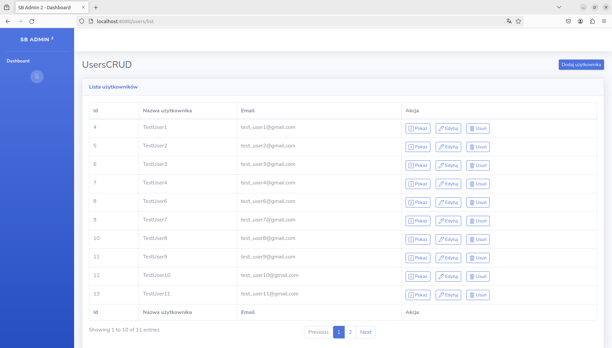

# UsersCRUD 

## Overview 
This simple web application allows admin to: 
* Create users.
* Edit existing users 
* Display user's details
* Delete users

## Used technologies 
Project was built based on Model view controller design pattern.
Model layer is implemented on Data Object Access design pattern that communicates with database.
Server is built using Tomcat, which also manages MySql database connection. 
Tomcat servlet container controls the application. 
View is provided by jsp files supported by JSTL library and Expression Language. 
View is based on bootstrap Admin - 2 theme: https://startbootstrap.com/theme/sb-admin-2.  

## Implementation 
### Connection
In order to create connection used Tomcat servlet container and configured DataSource. 
This DataSource is directly used in DBUtil class. 

### MySql database
Database contains `users` table that has the following columns: 
* id INT unsigned AUTO_INCREMENT PRIMARY KEY
* username VARCHAR(255)
* email VARCHAR(255) UNIQUE
* password VARCHAR(60)

In order to implement DAO pattern I created User class with data fields reflecting above columns. 
CRUD is implemented by UserDao class that with methods that will be described below.

### View
Servlets located in `servlets` directory are responsible for passing needed data to jsp files that use 
JSTL library to get access to passed data. 

## What application does how does it look in the code?
Every action to perform has its own servlet, jsp file and method in UserDao class. 

### READ ALL 
This the welcome page of my application. It lists all users from our database.

For populating list.jsp view with actual data retrieved from database responsible is ReadAll servlet
and its **doGet** method. 
This method uses two methods from UserDao class which is static data field in above servlet:
 
**countAll**: 
It returns number of the records present in database. 

**findUsersBasedOnOffsetAndLimit**:
Method accepts two parameters 
- `limit` - which is number of the records to display on the page (specified as const in ReadAll servlet under `RECORD_NUMBER_BY_PAGE` reference)
- `offset` - it is determined by `RECORD_NUMBER_BY_PAGE` and page number currently displayed.

Number of pages is calculated by dividing number of retrieved records by `RECORD_NUMBER_BY_PAGE`.
Current page number is determined by passed parameter `pageIndex` in page url. 
This parameter is set in list.jsp file by clicking either "Next", "Previous" button or directly by 
clicking on specific page button. Initially is set to 1. 
Implemented mechanism sets the offset based on `currentPage` displayed. 
Then only specific number of records is queried by **findUsersBasedOnOffsetAndLimit** method. 
Then list of users is passed to the view and displayed in `forEach` JSTL loop tag. 
It recognises the first as well as the last page displayed and disables "Previous" or "Next" button.
It gives also information which records are currently displayed (this information is calculated by current page index and `RECORD_NUMBER_BY_PAGE`)

###

## Thoughts and future project extensions
Project helped me get little better familiar with using servlets, database connection, SQL as well as with 
passing data from controller to view via attributes and parameters. 
In the future project would be easily extended with adding additional database storing admin records that 
could manage list of users. Every admin would have to go through login process in order to get access to CRUD 
options. This could be achieved using for example filter. It would be also good to implement soft delete option 
including time of deletion, admin id that performed this as well as include additional columns in database that
tracks last edit datetime and admin that edited particular user. It would be also good to use any revertable hashing
method to hash id that are passed as parameters to url. And of course JavaScript must be added to make this 
application more interactive. 

