# UsersCRUD 

## Overview 
This simple web application allows admin to: 
* Create users.
* Edit existing users 
* Display user's details
* Delete users

## Used technologies 
Project was built based on Model view controller design pattern.
Model layer is implemented on Data Object Access design pattern that communicates with database.
Server is built using Tomcat, which also manages MySql database connection. 
Tomcat servlet container controls the application. 
View is provided by jsp files supported by JSTL library and Expression Language. 
View is based on bootstrap Admin - 2 theme: https://startbootstrap.com/theme/sb-admin-2.  

## Implementation 
### Connection
In order to create connection I used Tomcat servlet container and configured DataSource. 
This DataSource is directly used in DBUtil class. 

### MySql database
Database contains `users` table that has the following columns: 
* id INT unsigned AUTO_INCREMENT PRIMARY KEY
* username VARCHAR(255)
* email VARCHAR(255) UNIQUE
* password VARCHAR(60)

In order to implement DAO pattern I created User class with data fields reflecting above columns. 
CRUD is implemented by UserDao class that with methods that will be described below.

### View
Servlets located in `servlets` directory are responsible for passing needed data to jsp files that use 
JSTL library to get access to passed data. 

## What application does how does it look in the code?
Every action to perform has its own servlet, jsp file and method in UserDao class. 

### READ ALL 
This the welcome page of my application. It lists all users from our database.

For populating list.jsp view with actual data retrieved from database responsible is ReadAll servlet
and its **doGet** method. 
This method uses two methods from UserDao class which is static data field in above servlet:
 
**countAll**: 
It returns number of the records present in database. 

**findUsersBasedOnOffsetAndLimit**:
Method accepts two parameters 
- `limit` - which is number of the records to display on the page (specified as const in ReadAll servlet under `RECORD_NUMBER_BY_PAGE` reference)
- `offset` - it is determined by `RECORD_NUMBER_BY_PAGE` and page number currently displayed.

Number of pages is calculated by dividing number of retrieved records by `RECORD_NUMBER_BY_PAGE`.
Current page number is determined by passed parameter `pageIndex` in page url. 
This parameter is set in list.jsp file by clicking either "Next", "Previous" button or directly by 
clicking on specific page button. Initially is set to 1. 
Implemented mechanism sets the offset based on `currentPage` displayed. 
Then only specific number of records is queried by **findUsersBasedOnOffsetAndLimit** method. 
Then list of users is passed to the view and displayed in `forEach` JSTL loop tag. 
It recognises the first as well as the last page displayed and disables "Previous" or "Next" button.
It gives also information which records are currently displayed (this information is calculated by current page index and `RECORD_NUMBER_BY_PAGE`)

### CREATE 
For creation of new user responsible is Create servlet, create method from UserDao class along with helper 
InputValidator class. 
Every input has requirements to get positively validated: 

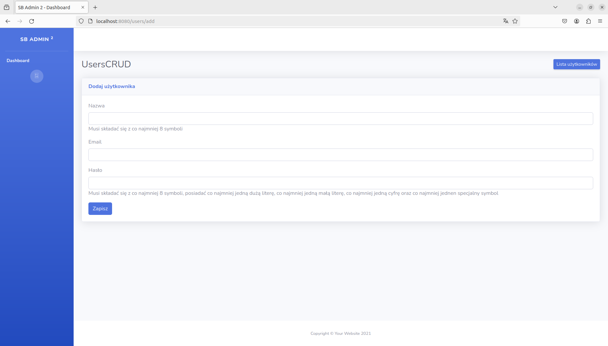

InputValidator validates input username, email and password.
* **username** requirements from regex: 
  * must contain alphanumeric characters
  * minimum 8 to 20 characters
  * first character has to be alphanumeric
  * can contain ',' or '_' but they cannot be typed as two in the row for example: "__" or "._" or "_." or ".." - username will be invalid with such combination.
  * lat character also has to be alphanumeric 
* **email** regex is standard. Please see below: 
    * "[_a-zA-z0-9-]+(\\.[_a-zA-Z0-9-]+)*@[a-zA-Z0-9-]+(\\.[_a-zA-Z0-9-]+)*\\.([a-zA-Z]{2,}){1}"
* **password** requirements from regex: 
    * Minimum eight characters 
    * at lead one upper case character 
    * at least one lowercase character 
    * at least one number
    * at least one special character 

Servlet method **doGet** is responsible for displaying create user form. 
First validation is performed by front end `required` input tag attribute, so we avoid sending request with blank data.
After all fields are populated with some input, then doPost method gets parameters. 
Then given parameters are used in instantiation User object which will be used as parameter for 
create method from UserDao class.
Then helper class InputValidator static method ValidateUser gets invoked that validates every data field from User instance. 
Then two scenarios are possible:
If validation returns boolean false then method terminates returning null value - which means that update query 
is not even executed. 
Then doPost method checks the User instance returned from **create** method and sets `input` parameter 
accordingly. If user is added in database then `input` is set to "valid", "invalid" otherwise.
Then we get redirected again to doGet method that checks `input` parameter. It sets `isUserAdded` attribute accordingly.
Based on its value different views are displayed: 
* If `isUserAdded` is null add user form will get displayed. 
* If `isUserAdded` is set to "false" it means either that data provided is invalid or provided e-mail is already assigned to other user:

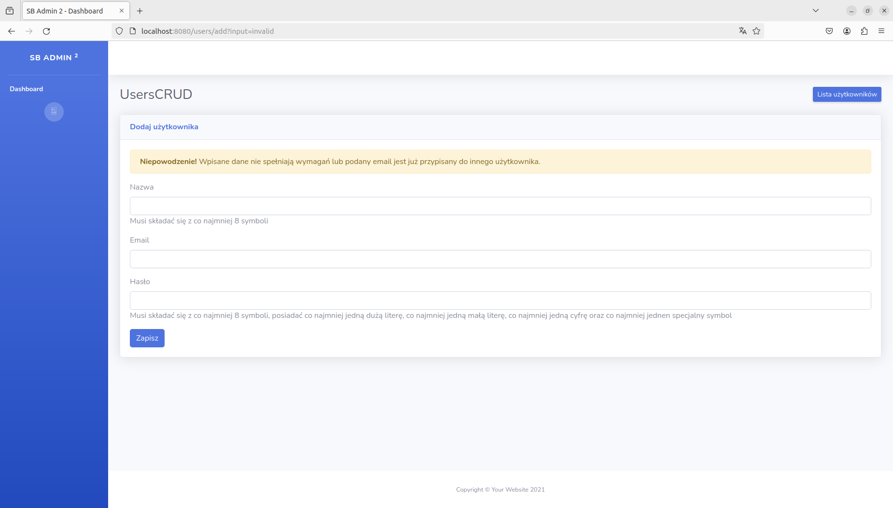

If validation returns boolean value true then Connection to database is created along with PreparedStatement.
Before new record added then password is hashed using **Bcrypt** class and its method **hashpw**.
If provided email is not assigned to the other record in database then generated id is set to User instance that will
be returned from method. If there is already email assigned then SQLException is caught and method terminates returning null. 
Then again doPost method checks if returned value is valid instance of User class. If it does then `input` is set to be
"valid". 
Based on that parameter, doGet method sets `isUserAdded` to boolean true that will determine what will be displayed 
in add-user-form.jsp file: 

### EDIT
For edition of the user responsible is Edit servlet, update method from UserDao class along with helper
InputValidator class.
If user enters url manually without any `id` parameter specified, then doGet method will redirect to 
pageNotFound servlet: 

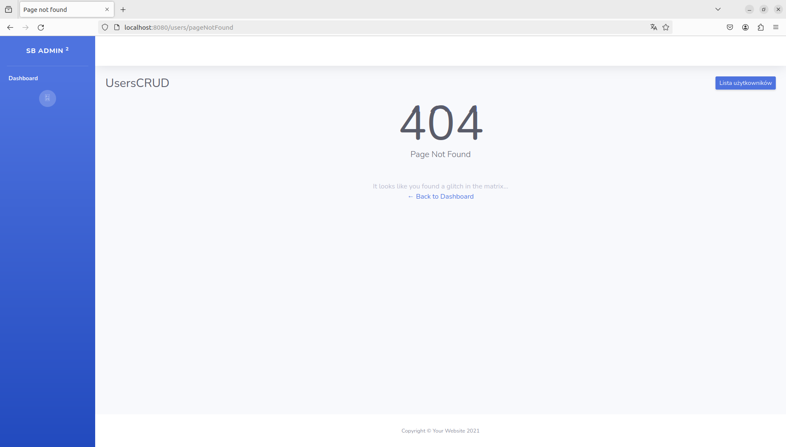

If admin user enters url with id parameter value that is not in database then read method from UserDao class will
return null which is going to be passed as `user` attribute for edit-user-form.jsp.
Then such view will be displayed:

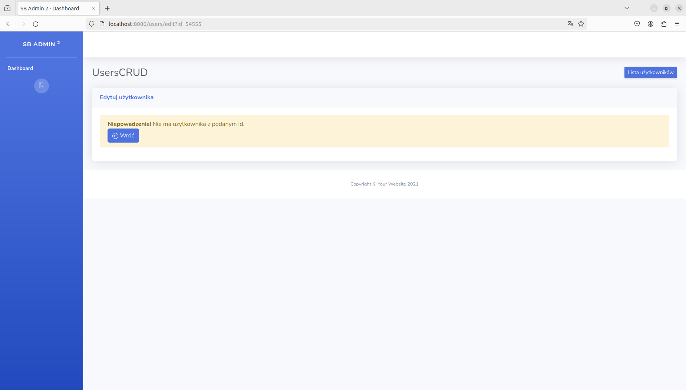

To edit user we click edit button that is displayed along with show and delete buttons in list.jsp file. 
Every edit button is an anchor tag that sets `id` parameter taken from displayed record.
This `id` parameter is taken by doGet method of Edit servlet. 
Then given id is used in read method from UserDao class that created User instance based on retrieved data.
User instance is passed to the view as attribute of which data fields will populate(except password) edit-user-form.jsp fields:

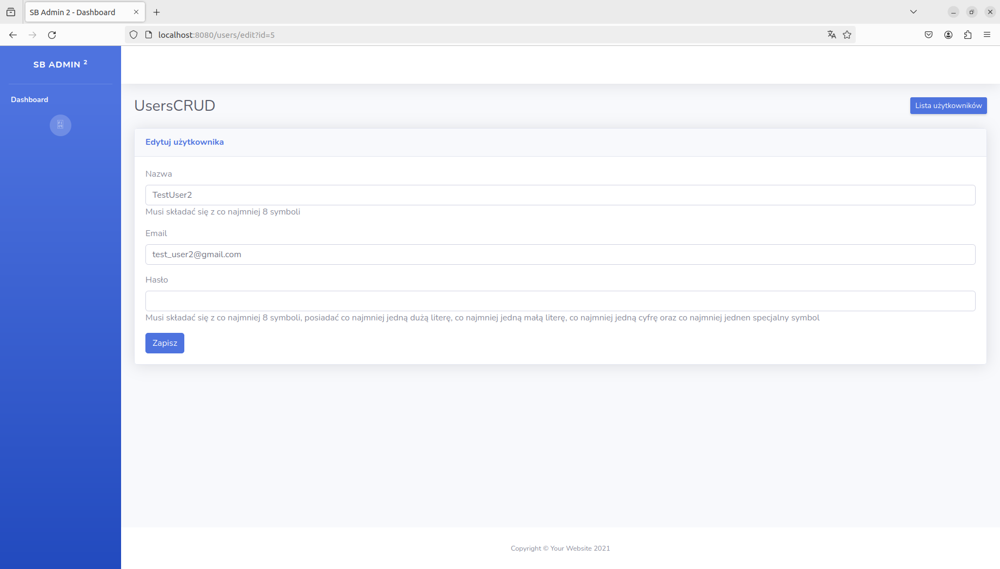

After all input fields got some data entered and edit button clicked then all data is passed to doPost method.
Then passed `username`, `email`, `password` will be used to instantiate new User object that will be passed as 
parameter to update method from UserDao class. This method also uses InputValidator to check if passed data fields from
User object meet requirements. If they don't then update method returns false which results with setting attribute 
`isUserUpdated` to false and passing attribute `user` as user with old data. 
It will result with such view displayed: 

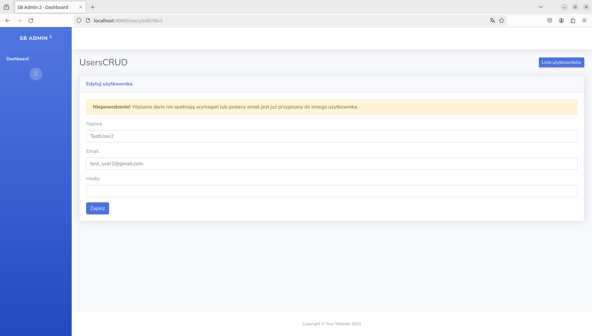

If InputValidator returns true then Connection to database is created along with PreparedStatement object. 
If provided email is used in other record then again above screen will be displayed (`isUserUpdated` will be set to false).
However, if database record gets updated then `isUserUpdated` will be set to true and `user` attribute will be set to 
updated instance of User class (with newly entered data). 
These attributes are again passed to edit-user-form.jsp file which will result in such view displayed: 

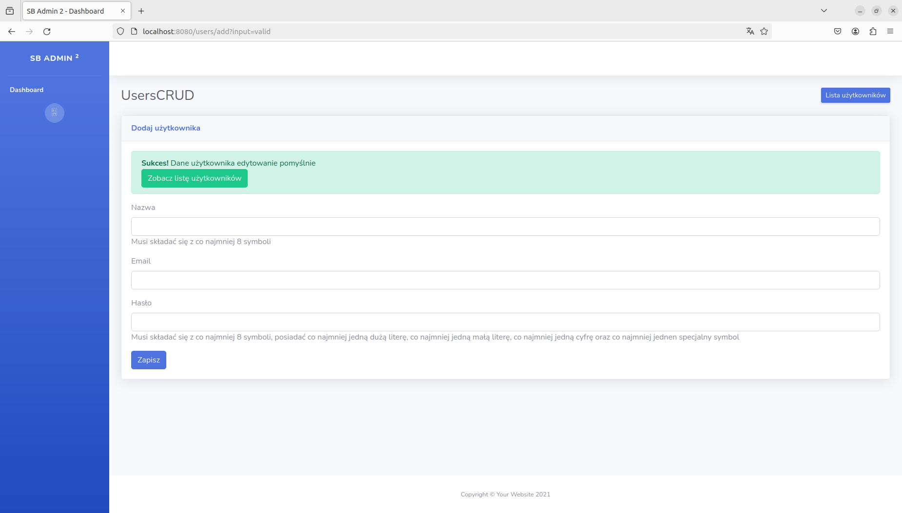

### DELETE
For deletion of the user responsible is Delete servlet and delete method from UserDao class.
If admin user enters invalid `id` parameter in url then admin gets redirected to pageNotfound view: 

If admin enters `id` parameter in url that is not in database then there is no user to delete. 
It will set attribute `isDeleted` to false. It is passed to delete.jsp file. It will result with such 
view: 

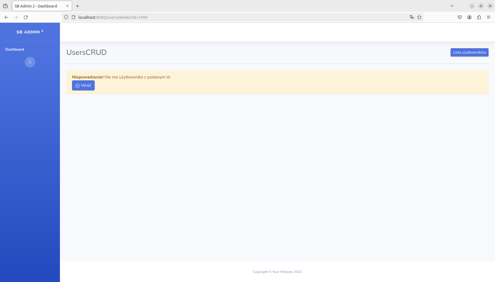

If admin clicks delete button associated with particular record in list.jsp then valid id is passed to 
delete method of UserDao class. 
If deletion is successfull then `isDeleted` attribute is set to true. It results with such view: 

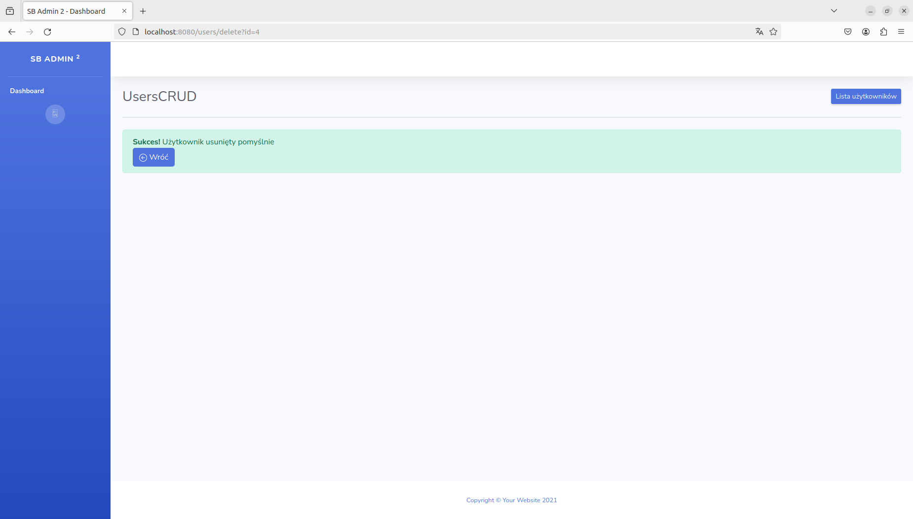

### READ 
ShowUser servlet, read method from UserDao class and  show.jsp file are responsible to display user details. 
If admin user enters url without `id` parameter specified then again will be redirected to pageNotFound address.
If admin enters url with `id` parameter that is not associated with any record in database then read method 
from userDao class will return null. This object is then set to `user` attribute and passed to show.jsp file. 
Then based on value form `user` attribute following information will be displayed: 

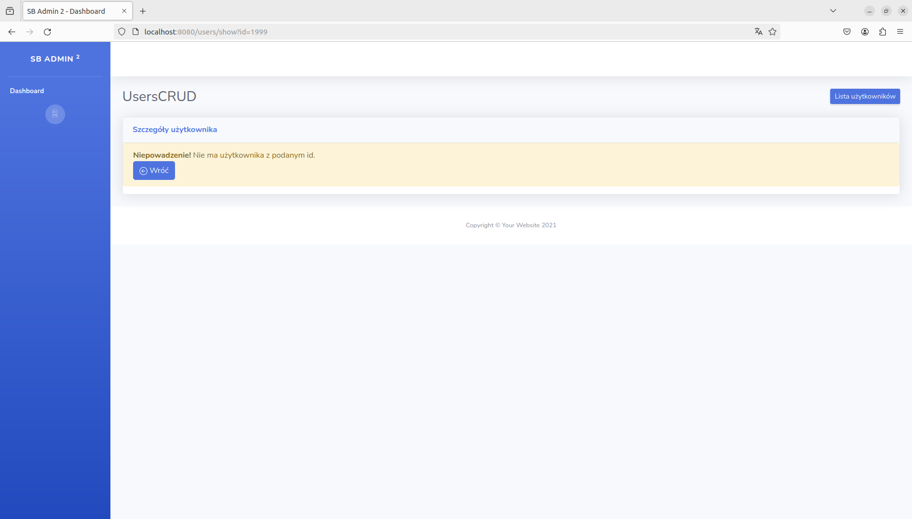

To show user we click show button that is displayed along with delete and edit buttons in list.jsp file.
Every show button is an anchor tag that sets `id` parameter taken from displayed record.
This it is passed as argument for `userId` parameter from read method from UserDao class. 
If record with given id exists in database then from retrieved data instance of User class is created and 
returned to doGet method from ShowUser servlet. Then this instance is set as an `user` attribute and
passed to show.jsp file. 
Data fields from User instance will populate table rows to display all data except password: 

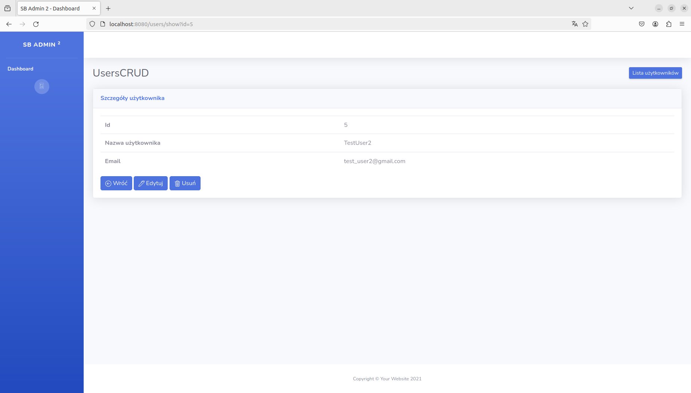

## Thoughts and future project extensions
Project helped me get little better familiar with using servlets, database connection, SQL as well as with 
passing data from controller to view via attributes and parameters. 
In the future project would be easily extended with adding additional database storing admin records that 
could manage list of users. Every admin would have to go through login process in order to get access to CRUD 
options. This could be achieved using for example filter. It would be also good to implement soft delete option 
including time of deletion, admin id that performed this as well as include additional columns in database that
tracks last edit datetime and admin that edited particular user. It would be also good to use any revertable hashing
method to hash id that are passed as parameters to url. And of course JavaScript must be added to make this 
application more interactive. 

